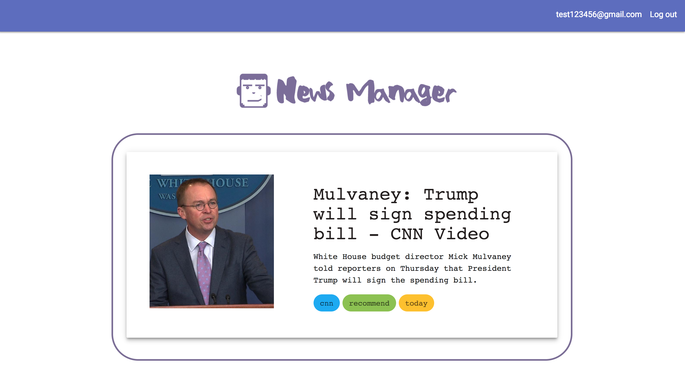
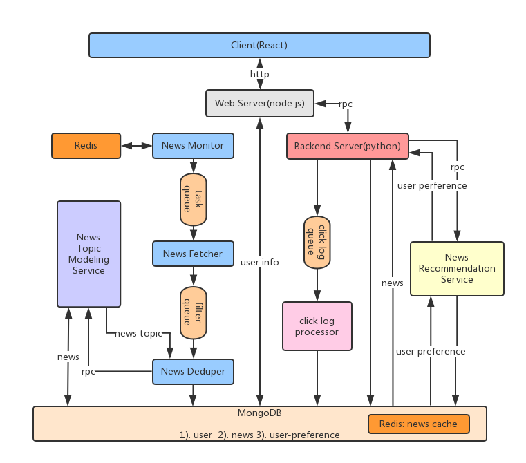

# News Manager

## Introduction
News Manager is a real time news scraping and recommendation system. This system uses a news pipeline to scrape latest news from various of resources such CNN, BBC and Bloomberg etc. To render the news, this system integrates with a single-page web application built by React. In addition, it generates a customized news list for each user based on news topics. To achieve this function, a click log processor collects users’ click logs to update a news preference model for each user, and an offline training pipeline models news topics.



## Architecture


__SOA__

* __Client__: a single-page web application built by React.
* __Web Server__: handles the sign-up and login functions with node.js and Express.
* __Backend Server__: requests news from database, labels specific news with "recommend" tag based on the response of news recommendation service and sends user's click events to click log processor
* __News Recommendation Service__: responses a list of prefered news topics for the current user.
* __Click Log Processor__: updates a user's preference model using a time decay method.
* __News Topic Modeling Service__: predicts news topics using a CNN model generated by an offline training pipeline.
* __News Monitor__: with the help of News API, finds the latest news from 20+ resource websites. It integrates with Redis to filter news with the same titles.
* __News Fetcher__: obtains a scraping task from the task queue and scrapes news using Newspaper3K library.
* __News Deduper__: utilizes NLP techniques to compare the content of the scraped news and existing news in mongoDB, calls the news topic modeling service and then stores the unique news into database.

## How to run it
To set up this system
```
./launcher.sh
```

To scrape more news
```
cd news_pipeline
./news_pipeline_launcher.sh
```

To update user'preference model
```
cd news_recommendation_service
python3 click_log_processor.py
```


